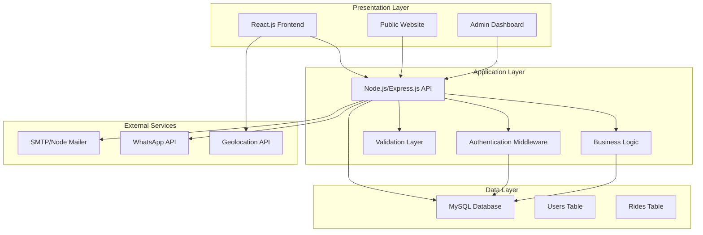
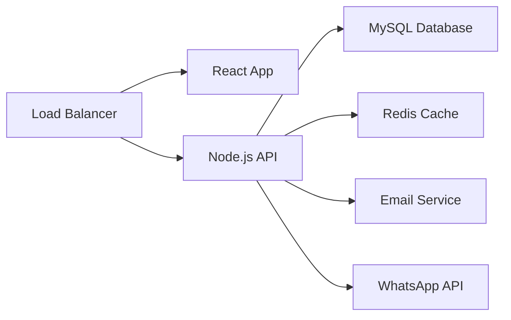

# Design Document

## Overview

The Ryde taxi booking application is a full-stack web application built using React.js frontend, Node.js/Express.js backend, and MySQL database. The system follows a three-tier architecture pattern with clear separation between presentation, application, and data layers. The application serves two primary user types: customers who book rides through a public website, and administrators who manage bookings through a secure dashboard.

## Architecture

### System Architecture Diagram



### Technology Stack

- **Frontend**: React.js with responsive design
- **Backend**: Node.js with Express.js framework
- **Database**: MySQL with proper indexing
- **Authentication**: JWT tokens with bcrypt password hashing
- **Email Service**: Node Mailer with SMTP configuration
- **Notifications**: WhatsApp Business API integration
- **Location Services**: Browser Geolocation API

## Components and Interfaces

### Frontend Components

#### Public Website Components
```
src/
├── components/
│   ├── common/
│   │   ├── Header.jsx
│   │   ├── Footer.jsx
│   │   └── Layout.jsx
│   ├── home/
│   │   ├── HeroBanner.jsx
│   │   ├── BookingForm.jsx
│   │   ├── ServicesSection.jsx
│   │   ├── WhyChooseUs.jsx
│   │   ├── FleetOptions.jsx
│   │   ├── HowItWorks.jsx
│   │   ├── FAQ.jsx
│   │   ├── CallToAction.jsx
│   │   └── PaymentMethods.jsx
│   ├── about/
│   │   └── AboutContent.jsx
│   └── contact/
│       ├── ContactInfo.jsx
│       └── ContactForm.jsx
├── pages/
│   ├── Home.jsx
│   ├── About.jsx
│   └── Contact.jsx
└── services/
    └── api.js
```

#### Admin Dashboard Components
```
src/admin/
├── components/
│   ├── auth/
│   │   └── LoginForm.jsx
│   ├── dashboard/
│   │   ├── Analytics.jsx
│   │   ├── EarningsChart.jsx
│   │   └── StatsCards.jsx
│   ├── rides/
│   │   ├── RideTable.jsx
│   │   ├── RideRow.jsx
│   │   └── StatusDropdown.jsx
│   └── layout/
│       ├── AdminHeader.jsx
│       ├── Sidebar.jsx
│       └── AdminLayout.jsx
├── pages/
│   ├── Login.jsx
│   ├── Dashboard.jsx
│   └── RideManagement.jsx
└── services/
    └── adminApi.js
```

### Backend API Structure

#### API Endpoints
```
/api/
├── public/
│   ├── POST /rides - Create new ride booking
│   ├── POST /contact - Submit contact form
│   └── GET /rides/:id - Get ride status (public)
├── admin/
│   ├── POST /auth/login - Admin authentication
│   ├── GET /rides - Get all rides with pagination
│   ├── PUT /rides/:id/status - Update ride status
│   ├── PUT /rides/:id/price - Update ride price
│   └── GET /analytics - Get earnings analytics
└── middleware/
    ├── auth.js - JWT authentication
    ├── validation.js - Input validation
    └── rateLimit.js - API rate limiting
```

#### Express.js Server Structure
```
server/
├── controllers/
│   ├── rideController.js
│   ├── adminController.js
│   └── contactController.js
├── middleware/
│   ├── auth.js
│   ├── validation.js
│   └── errorHandler.js
├── models/
│   ├── Ride.js
│   └── User.js
├── routes/
│   ├── rides.js
│   ├── admin.js
│   └── contact.js
├── services/
│   ├── emailService.js
│   ├── whatsappService.js
│   └── analyticsService.js
├── config/
│   ├── database.js
│   └── config.js
└── app.js
```

## Data Models

### Database Schema

#### Users Table (Admin)
```sql
CREATE TABLE users (
    id INT PRIMARY KEY AUTO_INCREMENT,
    email VARCHAR(255) UNIQUE NOT NULL,
    password VARCHAR(255) NOT NULL,
    role ENUM('admin') DEFAULT 'admin',
    created_at TIMESTAMP DEFAULT CURRENT_TIMESTAMP,
    updated_at TIMESTAMP DEFAULT CURRENT_TIMESTAMP ON UPDATE CURRENT_TIMESTAMP
);
```

#### Rides Table
```sql
CREATE TABLE rides (
    id INT PRIMARY KEY AUTO_INCREMENT,
    pickup_location TEXT NOT NULL,
    destination TEXT NOT NULL,
    country_code VARCHAR(10) NOT NULL,
    phone_number VARCHAR(20) NOT NULL,
    passengers INT NOT NULL CHECK (passengers BETWEEN 1 AND 8),
    bags INT NOT NULL CHECK (bags >= 0),
    schedule_time DATETIME,
    is_scheduled BOOLEAN DEFAULT FALSE,
    status ENUM('booked', 'in_progress', 'completed') DEFAULT 'booked',
    price DECIMAL(10,2) DEFAULT NULL,
    created_at TIMESTAMP DEFAULT CURRENT_TIMESTAMP,
    updated_at TIMESTAMP DEFAULT CURRENT_TIMESTAMP ON UPDATE CURRENT_TIMESTAMP,
    INDEX idx_status (status),
    INDEX idx_created_at (created_at),
    INDEX idx_schedule_time (schedule_time)
);
```

### Data Transfer Objects (DTOs)

#### Ride Booking DTO
```javascript
const RideBookingDTO = {
    pickup_location: String,
    destination: String,
    country_code: String,
    phone_number: String,
    passengers: Number, // 1-8
    bags: Number, // 0-5+
    schedule_time: Date, // Optional
    is_scheduled: Boolean
};
```

#### Admin Analytics DTO
```javascript
const AnalyticsDTO = {
    period: String, // '7days', '1month', '6months', '1year'
    total_earnings: Number,
    total_rides: Number,
    completed_rides: Number,
    pending_rides: Number,
    earnings_data: Array // Time series data for charts
};
```

## Error Handling

### Frontend Error Handling
- Form validation with real-time feedback
- API error handling with user-friendly messages
- Loading states for all async operations
- Fallback UI for geolocation failures

### Backend Error Handling
```javascript
// Global error handler middleware
const errorHandler = (err, req, res, next) => {
    const statusCode = err.statusCode || 500;
    const message = err.message || 'Internal Server Error';
    
    res.status(statusCode).json({
        success: false,
        error: message,
        ...(process.env.NODE_ENV === 'development' && { stack: err.stack })
    });
};
```

### Error Types
- Validation errors (400)
- Authentication errors (401)
- Authorization errors (403)
- Not found errors (404)
- Server errors (500)
- External service errors (502)

## Testing Strategy

### Frontend Testing
- **Unit Tests**: Component testing with React Testing Library
- **Integration Tests**: API integration testing
- **E2E Tests**: Critical user flows with Cypress
- **Accessibility Tests**: WCAG compliance testing

### Backend Testing
- **Unit Tests**: Controller and service function testing with Jest
- **Integration Tests**: API endpoint testing with Supertest
- **Database Tests**: Model and query testing
- **Security Tests**: Authentication and authorization testing

### Test Coverage Requirements
- Minimum 80% code coverage for backend
- Minimum 70% code coverage for frontend
- 100% coverage for critical booking flow
- All API endpoints must have integration tests

## Security Considerations

### Authentication & Authorization
- JWT tokens with 24-hour expiration
- Bcrypt password hashing with salt rounds of 12
- Role-based access control for admin routes
- Session management with secure cookies

### Input Validation
- Server-side validation for all inputs
- SQL injection prevention with parameterized queries
- XSS protection with input sanitization
- CSRF protection with tokens

### API Security
- Rate limiting: 100 requests per 15 minutes per IP
- CORS configuration for allowed origins
- Helmet.js for security headers
- Input size limits to prevent DoS attacks

## Performance Optimization

### Frontend Performance
- Code splitting with React.lazy()
- Image optimization and lazy loading
- Caching strategies for static assets
- Minification and compression

### Backend Performance
- Database indexing on frequently queried fields
- Connection pooling for MySQL
- Response caching for analytics data
- Pagination for large datasets

### Database Optimization
- Proper indexing strategy
- Query optimization
- Connection pooling
- Regular maintenance and monitoring

## Deployment Architecture

### Production Environment


### Environment Configuration
- Development: Local MySQL, file-based sessions
- Staging: Cloud database, Redis sessions
- Production: Clustered setup, external services

This design provides a scalable, secure, and maintainable foundation for the Ryde taxi booking application while meeting all specified requirements and technology constraints.